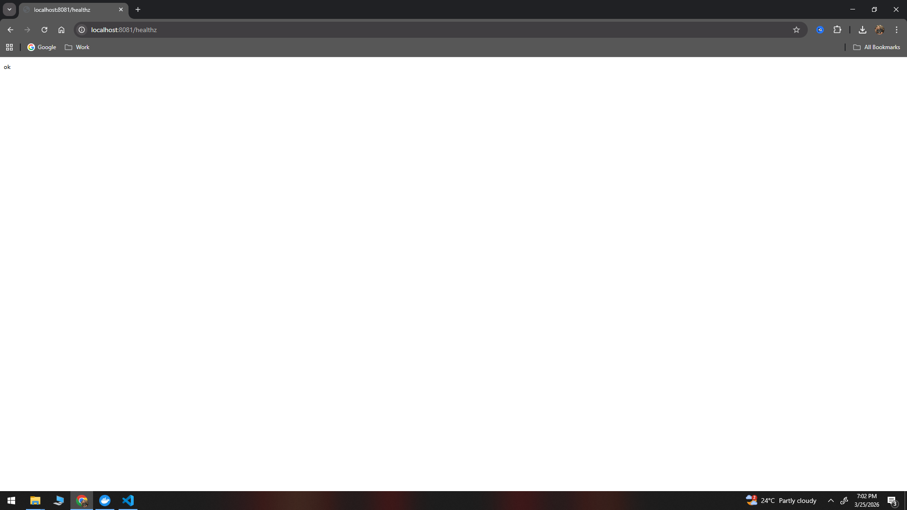
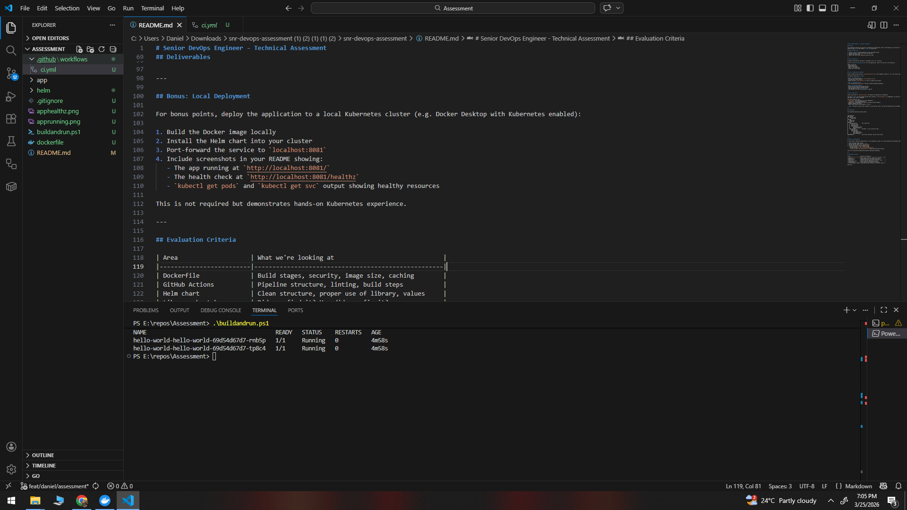
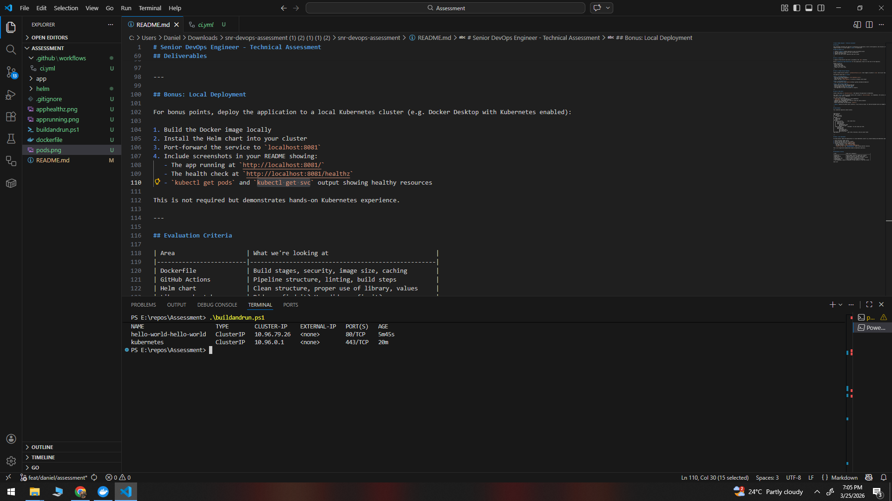

# ..\helm\lib-common\templates\_deployment.tpl
Fixed indentation issue in lib-common deployment template.
The ports field must be a property of the container object

# DL3018 warning: Pin versions in apk add. Instead of `apk add <package>` use `apk add <package>=<version>`
Removed ssl cert from dockerfile, not needed for this application

Chart running on local cluster:

